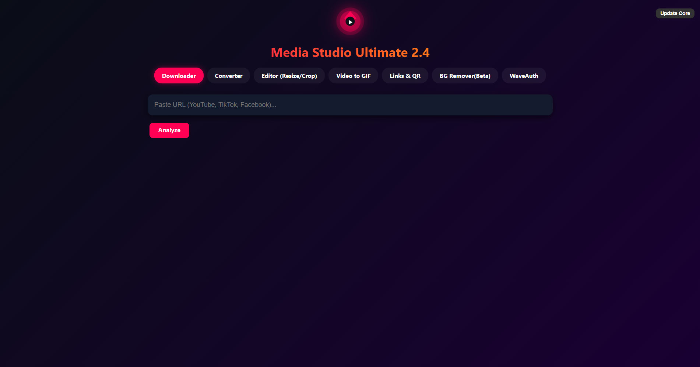

# Media Studio Ultimate 2.2


**An all-in-one media powerhouse: Download, Convert, Edit, Resize, Crop & Create GIFs**  
Beautiful Modern UI • Batch Processing • Visual Crop Editor • 60+ Format Support

---

## ✨ Features

### 🎬 Smart Downloader
- Download from **YouTube, TikTok, Instagram, Facebook, Twitter/X, SoundCloud** + 1000+ sites
- Choose video quality (4K/2K/1080p/720p/480p) and FPS (60/30/Auto)
- Extract audio as MP3 with quality selection (320/192/128 kbps)
- Built-in video analyzer with thumbnail preview
- One-click library updates (yt-dlp)

### 🔄 Universal Converter
- **Batch convert** multiple files at once
- Support for **60+ formats** across Video, Audio, and Image categories
- Visual format selector with search functionality
- Smart format categorization:
  - **Video**: MP4, MKV, AVI, MOV, WebM, FLV, GIF, and 15+ more
  - **Audio**: MP3, WAV, AAC, FLAC, OGG, M4A, and 10+ more
  - **Image**: JPG, PNG, GIF, WebP, BMP, TIFF, SVG, and more
- Progress tracking for batch operations
- Auto-open output folder

### ✂️ Visual Editor (Resize/Crop)
- **Interactive visual crop tool** with drag-and-drop handles
- Multiple crop shapes: Rectangle, Circle/Oval, Triangle
- Real-time preview for images and videos
- Precise resize controls (maintain aspect ratio or set custom dimensions)
- Support for both images and videos
- Pixel-perfect accuracy with coordinate display

### 🎭 Background Remover
- **One-click background removal** using advanced AI (U2Net)
- Drag and drop or open file
- Instant preview of result
- Batch compatible (via API, UI handles single file for now)
- High-quality transparency output (PNG)

### 🎨 Video to GIF Maker
- Convert any video segment to high-quality animated GIF
- **Visual crop editor** for GIF output
- Trim controls (start/end time in seconds)
- Adjustable FPS (frame rate) and width
- Real-time video preview with controls
- Optimized palette generation for best quality

---

## 🖼️ Screenshot

<div align="center">

<p><em>Media Studio Ultimate 2.2 - All-in-One Interface</em></p>
</div>

---

## 🚀 Quick Start

### Requirements
- **Python 3.9+**
- **FFmpeg** (must be in PATH or in the same folder)

### Installation (Windows - Super Easy!)

1. **Download/Clone** this repository
2. **Double-click** `install_libs.bat` to install dependencies
3. **Double-click** `run.bat` to launch the application
4. **Enjoy!** 🎉

### Installation (Manual / All Platforms)

```bash
# Clone the repository
git clone https://github.com/dat514/MediaStudioUltimate.git
cd MediaStudioUltimate

# Install dependencies
pip install pywebview yt-dlp qrcode pillow rembg

# Run the application
python main.py
```

### FFmpeg Setup

**Windows:**
1. Download FFmpeg from [ffmpeg.org](https://ffmpeg.org/download.html)
2. Either add to PATH or place `ffmpeg.exe` in the same folder as `main.py`

**macOS:**
```bash
brew install ffmpeg
```

**Linux:**
```bash
sudo apt install ffmpeg  # Ubuntu/Debian
sudo yum install ffmpeg  # CentOS/RHEL
```

---

## 📚 How to Use

### 🎬 Downloader

1. **Paste URL** from any supported site (YouTube, TikTok, Instagram, Facebook, etc.)
2. **Click Analyze** to fetch video info and thumbnail
3. **Choose format**: Video (MP4/MKV) or Audio (MP3)
4. **Select quality**: 
   - For videos: Choose resolution (4K/2K/1080p/720p/480p) and FPS (60/30/Auto)
   - For audio: Choose bitrate (320/192/128 kbps)
5. **Click Download** and select save location
6. **Done!** Folder opens automatically

**Supported Sites**: [1000+ sites supported by yt-dlp](https://github.com/yt-dlp/yt-dlp/blob/master/supportedsites.md)

### 🔄 Converter

1. **Click "+ Add Files"** to select one or multiple files
2. **Click "Change Format"** to open the visual format selector
3. **Search or browse** through 60+ formats organized by category (Video/Audio/Image)
4. **Select target format** (e.g., MP4, MP3, PNG, WebP)
5. **Click "Start Batch Conversion"** and choose output folder
6. **Watch progress** as files convert automatically
7. **Output folder opens** when done

**Tip**: Perfect for batch converting entire folders!

### ✂️ Visual Editor

1. **Click "Open File"** to select an image or video
2. **Resize** (Optional): Enter custom width/height
3. **Crop** (Optional):
   - Click **"Toggle Visual"** to show interactive crop box
   - **Drag** the box to reposition
   - **Drag corner handles** to resize precisely
   - Choose **shape**: Rectangle, Circle, or Triangle
4. **Click "Save / Process"** and select output folder

**Use Cases**: Create circular profile pictures, crop videos for social media, resize images for web

### 🎨 GIF Maker

1. **Click "Open Video"** to load a video file
2. **Set trim points**: Enter start and end time in seconds (e.g., 0 to 5)
3. **Adjust settings**:
   - **FPS**: Frame rate (recommended: 15 for good quality/size balance)
   - **Width**: Output width in pixels (height auto-calculated)
4. **Crop** (Optional):
   - Click **"Toggle Visual"** to show crop box
   - Drag and resize to select specific region
5. **Click "Create GIF"** and select output folder
6. **Preview appears** automatically!

**Pro Tips**: 
- Use FPS 10-15 for memes, 20-30 for smooth animations
- Keep width under 600px for reasonable file sizes

### 🎭 Background Remover

1. **Click "BG Remover"** tab.
2. **Click "Open Image"** and select your photo.
3. **Click "Remove Background"**.
   - *Note: First run downloads the AI model (~176MB).*
4. **Preview** the transparent result.
5. **Click "Download Result"** to save.

---

## 🔧 Advanced Features

### Update Core Libraries

**Option 1: In-App Update**
- Click the **"Update Core"** button in the top-right corner

**Option 2: Run Installer Again (Windows)**
- Double-click `install_libs.bat` to update to latest versions

**Option 3: Command Line**
```bash
pip install --upgrade yt-dlp instaloader
```

---

## 📁 Project Structure

```
MediaStudioUltimate/
├── main.py              # Main application
├── install_libs.bat     # Dependency installer (Windows)
├── run.bat              # Quick launcher (Windows)
├── screenshots/         # Preview images
│   └── preview.png
├── ffmpeg.exe          # (Optional) FFmpeg binary
└── README.md           # This file
```

---

## 📝 Batch Files Explained

### `install_libs.bat` - First Time Setup
```batch
@echo off
title Install Dependencies - Media Studio Ultimate 2.0
color 0A
echo ========================================
echo  Media Studio Ultimate 2.0
echo  Dependency Installer
echo ========================================
echo.
echo Installing required libraries...
echo.
echo.
pip install pywebview yt-dlp qrcode pillow rembg
echo.
echo.
echo ========================================
echo  Installation complete!
echo ========================================
echo.
echo You can now run the application using:
echo  - Double-click run.bat
echo  - Or run: python main.py
echo.
pause
```

### `run.bat` - Quick Launcher
```batch
@echo off
title Media Studio Ultimate 2.0
color 0B
echo ========================================
echo  Media Studio Ultimate 2.0
echo  Starting application...
echo ========================================
echo.
python main.py
echo.
echo ========================================
echo  Application closed.
echo ========================================
pause
```

**Usage:**
1. First time: Run `install_libs.bat`
2. Every time after: Just double-click `run.bat`

---

## 🎨 UI Highlights

- **Modern Dark Theme** with gradient backgrounds and neon accents
- **Tab-based Navigation** for easy switching between tools
- **Interactive Crop Editors** with real-time visual feedback
- **Visual Format Selector** with search functionality
- **Smooth Animations** throughout the interface
- **Status Updates** for all operations

---

## 🛠️ Technical Details

### Built With
- **Python 3.9+** - Core application logic
- **pywebview** - Lightweight GUI (no Electron bloat)
- **yt-dlp** - Universal media downloader engine
- **FFmpeg** - Media processing and conversion
- **HTML/CSS/JavaScript** - Embedded modern UI

### Architecture
- Single Python file with embedded HTML interface
- Built-in HTTP server (port 8000) for local media streaming
- Async API communication between Python and JavaScript
- Cross-platform file dialogs

---

## 📋 System Requirements

- **OS**: Windows 7+, macOS 10.13+, Linux (Ubuntu 18.04+)
- **Python**: 3.9 or higher
- **RAM**: 2GB minimum, 4GB recommended
- **Storage**: 100MB for app + space for media files
- **FFmpeg**: Required (see installation above)

---

## 🐛 Known Limitations

- **Private content**: Some Instagram/Facebook private videos require authentication
- **DRM content**: Netflix, Spotify, Disney+ are NOT supported (DRM protection)
- **Large batches**: Converting 100+ files may take considerable time
- **Triangle crop**: Beta feature, may not work perfectly on all codecs
- **GIF file size**: High FPS + long duration = large files

---

## 🔧 Troubleshooting

### "FFmpeg not found" error
- **Solution**: Download FFmpeg and place `ffmpeg.exe` in the same folder as `main.py`, or add FFmpeg to your system PATH

### "Module not found" error
- **Solution**: Run `install_libs.bat` (Windows) or `pip install pywebview yt-dlp` manually

### Video download fails
- **Solution**: Click "Update Core" button to update yt-dlp to the latest version
- **Or**: Run `pip install --upgrade yt-dlp`

### Application won't start
- **Solution**: Make sure Python 3.9+ is installed and added to PATH
- **Check**: Open CMD and run `python --version`

### run.bat shows error
- **Solution**: Make sure you ran `install_libs.bat` first
- **Or**: Install dependencies manually with `pip install pywebview yt-dlp`
---

## 📝 Changelog

### Version 2.2 (Current)
- ✨ Added Universal Converter with 60+ formats
- ✨ Added Visual Editor with interactive crop
- ✨ Added GIF Maker with trim and crop
- ✨ Visual format selector with search
- ✨ Batch conversion support
- ✨ Real-time preview for all media
- ✨ Added `install_libs.bat` for easy setup
- ✨ Added `run.bat` for quick launch
- 🎭 Added **Background Remover** 
- 🎨 Modern dark theme UI redesign
- 🎨 Smooth animations and transitions
- 🐛 Various bug fixes and improvements

---

## 📄 License

MIT License © 2025 dat514

---

## 🙏 Credits

### Core Technologies
- **[yt-dlp](https://github.com/yt-dlp/yt-dlp)** - Universal video downloader
- **[FFmpeg](https://ffmpeg.org)** - Media processing engine
- **[pywebview](https://pywebview.flowrl.com)** - Lightweight GUI framework
- **[Python](https://python.org)** - Programming language


---

<div align="center">

### ⭐


</div>
